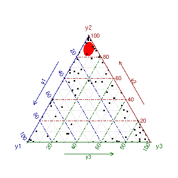

<!-- vignettes/example.Rmd is generated from vignettes_prebuild/example.Rmd. Please edit that file -->


# Introduction
This vignette is devoted to explain how to use the package **dirinla**. It is a R-package to fit Dirichlet regression models using **R-INLA**. It can be installed and upgraded via the repository https://github.com/inlabru-org/dirinla. In this manual, we simulate some data from a Dirichlet distribution to posteriorly fit them using the main function of the package **dirinla**.


```r
library(dirinla)
library(INLA)
library(DirichletReg)
library(ggplot2)
library(gridExtra)
```

# Simulation
We firstly illustrate how to simulate 100 data points from a Dirichlet regression model with three different categories and one different covariate per category:
\begin{align}
  \boldsymbol{Y}_n & \sim  \text{Dirichlet}(\alpha_{1n}, \ldots, \alpha_{3n}) \,, n = 1, \ldots, 100, \nonumber \\
  \log(\alpha_{1n}) & =  \beta_{01} + \beta_{11} v_{1n}, \nonumber \\
  \log(\alpha_{2n}) & =  \beta_{02} + \beta_{12} v_{2n},  \\
  \log(\alpha_{3n}) & =  \beta_{03} + \beta_{13} v_{3n}, \nonumber 
\end{align}
being the parameters that compose the latent field $\beta_{01}= -1.5$, $\beta_{02}=-2$, $\beta_{03}=0$ (the intercepts), and $\beta_{11}=1$, $\beta_{12}=2.3$, $\beta_{13}=-1.9$ (the slopes). Note that covariates are different for each category. This could be particularized for a situation where all of them are the same. For simplicity, covariates are simulated from a Uniform distribution on (0,1). To posteriorly fit the model, a following the structure of LGMs, Gaussian prior distributions are assigned with precision $10^{-4}$ to all the elements of the Gaussian field.


```r
### --- 2. Simulating from a Dirichlet likelihood --- ####
set.seed(1000)
N <- 100 #number of data
V <- as.data.frame(matrix(runif((4) * N, 0, 1), ncol = 4)) #Covariates
names(V) <- paste0('v', 1:4)

formula <- y ~ 1 + v1 | 1 + v2 | 1 + v3
(names_cat <- formula_list(formula))

intercepts <-
x <- c(-1.5, 1, #Cat 1
       -2, 2.3, #Cat 2
       0 , -1.9) #Cat 3

mus <- exp(x) / sum(exp(x))
C <- length(names_cat)
data_stack_construct <-
  data_stack_dirich(y = as.vector(rep(NA, N * C)),
                    covariates = names_cat,
                    data       = V,
                    d          = C,
                    n          = N)

A_construct <- data_stack_construct
A_construct[1:8, ]

eta <- A_construct %*% x
alpha <- exp(eta)
alpha <- matrix(alpha,
                ncol  = C,
                byrow = TRUE)
y_o <- rdirichlet(N, alpha)
colnames(y_o) <- paste0("y", 1:C)
head(y_o)
```

# Fitting the model
The next step is to call the **dirinlareg** function in order to fit a model to the data. We just need to specify the formula, the response variable, the covariates and the precision for the Gaussian prior distribution of the parameters.


```r
### --- 3. Fitting the model --- ####
y <- y_o
model.inla <- dirinlareg(
  formula  = y ~ 1 + v1 | 1 + v2 | 1 + v3,
  y        = y,
  data.cov = V,
  prec     = 0.0001,
  verbose  = TRUE)
```

To collect information about the fitted values and marginal posterior distributions of the parameters, we can use the methods **summary** and **plot** directly to the **dirinlaregmodel** object generated.

## Summary

```r
summary(model.inla)
#> 
#> Call: 
#>  dirinlareg(formula = y ~ 1 + v1 | 1 + v2 | 1 + v3, y = y, data.cov = V, 
#>     prec = 1e-04, verbose = TRUE)
#> 
#>  
#> ---- FIXED EFFECTS ---- 
#> ======================================================================= 
#> y1
#> ----------------------------------------------------------------------- 
#>             mean     sd 0.025quant 0.5quant 0.975quant   mode
#> intercept -1.554 0.2014    -1.9490   -1.554     -1.159 -1.554
#> v1         1.018 0.3690     0.2948    1.018      1.741  1.018
#> ======================================================================= 
#> y2
#> ----------------------------------------------------------------------- 
#>             mean     sd 0.025quant 0.5quant 0.975quant   mode
#> intercept -1.760 0.2329     -2.217   -1.760     -1.304 -1.760
#> v2         1.985 0.3971      1.206    1.985      2.763  1.985
#> ======================================================================= 
#> y3
#> ----------------------------------------------------------------------- 
#>               mean     sd 0.025quant 0.5quant 0.975quant     mode
#> intercept -0.05926 0.2500    -0.5493 -0.05926     0.4307 -0.05926
#> v3        -1.94703 0.4158    -2.7619 -1.94703    -1.1322 -1.94703
#> ======================================================================= 
#> 
#> ---- HYPERPARAMETERS ---- 
#> 
#>  No hyperparameters in the model 
#> ======================================================================= 
#> DIC = 1821.0258 , WAIC = 1711.0297 , LCPO = 913.8331 
#> Number of observations: 100
#> Number of Categories: 3
```

## Plot of the posterior distributions





# Predictions

The package provides a method predict to compute posterior predictive distributions for new individuals. To show how this function works, we will predict for a value of v1 = 0.2, v2 = 0.5, and v3 = -0.1:

```r
### --- 5. Predicting for v1 = 0.25, v2 = 0.5, v3 = 0.5, v4 = 0.1 --- ####
model.prediction <-
  predict(model.inla,
                  data.pred.cov = data.frame(v1 = 0.2 ,
                                         v2 = 0.5,
                                         v3 = -0.1))
#> 
#>  
#>  ---------------------- Predicting ----------------- 
#>  
#> 
model.prediction$summary_predictive_means
#> $y1
#>            Min.   1st Qu.    Median      Mean  3rd Qu.     Max.
#> [1,] 0.05081666 0.1148589 0.1373386 0.1405887 0.161967 0.329834
#> 
#> $y2
#>            Min.   1st Qu.    Median      Mean   3rd Qu.      Max.
#> [1,] 0.07885033 0.2031195 0.2470649 0.2530218 0.2966276 0.5925873
#> 
#> $y3
#>           Min.   1st Qu.    Median      Mean   3rd Qu.     Max.
#> [1,] 0.3085923 0.5550548 0.6093948 0.6063895 0.6598522 0.831211

### --- 6. We can also predict directly --- ####
model.inla <- dirinlareg(
  formula  = y ~ 1 + v1 | 1 + v2 | 1 + v3,
  y        = y,
  data.cov = V,
  prec     = 0.0001,
  verbose  = FALSE,
  prediction = TRUE,
  data.pred.cov = data.frame(v1 = 0.2 ,
                             v2 = 0.5,
                             v3 = -0.1))
#> 
#>  
#>  ---------------------- Looking for the mode ----------------- 
#>  
#>  
#>  ----------------------    INLA call    ----------------- 
#> 
#>  ---------------------- Obtaining linear predictor ----------------- 
#> 
#>  
#>  ---------------------- Predicting ----------------- 
#>  
#> 


model.prediction$summary_predictive_means
#> $y1
#>            Min.   1st Qu.    Median      Mean  3rd Qu.     Max.
#> [1,] 0.05081666 0.1148589 0.1373386 0.1405887 0.161967 0.329834
#> 
#> $y2
#>            Min.   1st Qu.    Median      Mean   3rd Qu.      Max.
#> [1,] 0.07885033 0.2031195 0.2470649 0.2530218 0.2966276 0.5925873
#> 
#> $y3
#>           Min.   1st Qu.    Median      Mean   3rd Qu.     Max.
#> [1,] 0.3085923 0.5550548 0.6093948 0.6063895 0.6598522 0.831211
```
